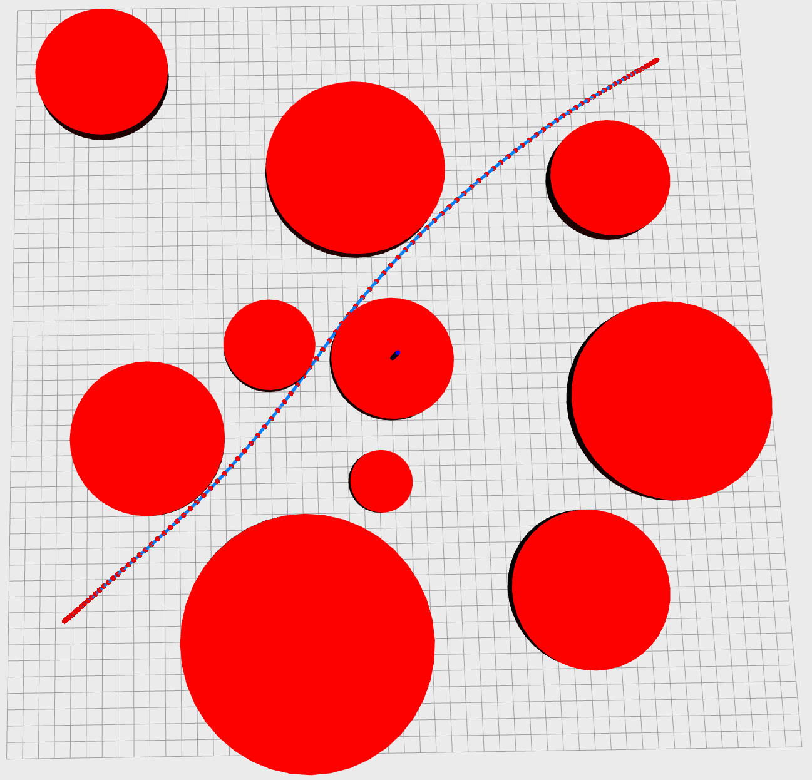
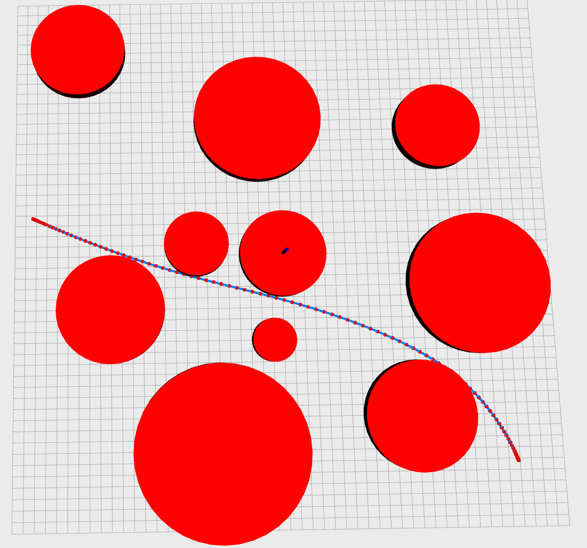

## Homework_2: Smooth Navigation Path Generation

#### 1. Requirement

* The code framework is based on [GCOPTER](https://github.com/ZJU-FAST-Lab/GCOPTER), which is an efficient and versatile multi-copter trajectory optimizer.
* ROS should be installed in advance. Ubuntu 20.04 and ROS noetic are recommended.

#### 2. Run

* Unzip and enter the folder.

* Execute the following terminal commands.

  ~~~bash
  ## you should source the ros setup in advance
  
  cd catkin_ws/src
  catkin_init_workspace
  
  cd..
  catkin_make
  
  source devel/setup.bash
  
  roslaunch gcopter curve_gen.cpp
  ~~~

#### 3. Result

* optimizing the path after choosing two target positions

  

  
  
  
  
  

