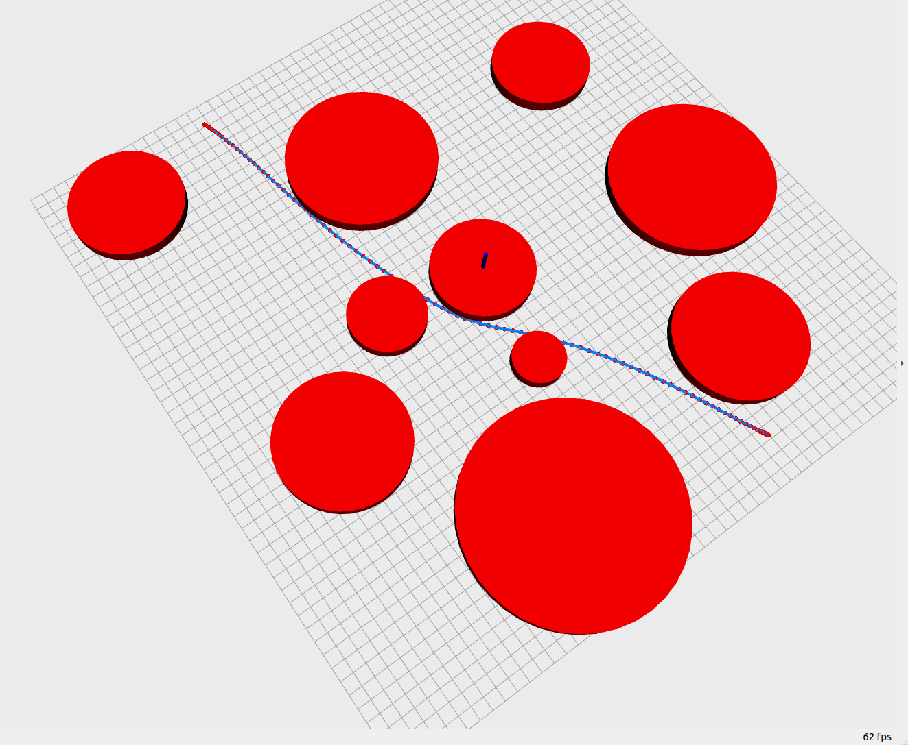

## Homework_2: Smooth Navigation Path Generation

#### 1. Workflow

* Three parts should be implemented to finish the homework: **lbfgs**,  **path_smoother**, **cubic_spline**
* The high level part of the code is in **curve_gen.cpp**
* After two target positions are selected, a **path_smoother** will be created and initialized
  * two target positions, piece number, obstacle information and penalty weight should be given to the setup function
  * curve, initial inner potions should be given to the optimize function to optimize the curve
  * **path_smoother** need to realize the call back function which could compute the cost and gradient for **lbfgs algorithm**
* The final path will be saved in the **cubic_curve** class, which has been finished in advance.
  * The **cubic_curve** can be seen as a group  of **cubic_polynomial**
  * The **cubic_curve** can be got from **cubic_spline** class, which is responsible for computing the information needed by the optimizer
* A **cubic_spline** class is initialized in the **smooth_optimizer**
  * the **cubic_spline** will compute the current stretch energy and gradient by points for the **lbfgs** optimizer after setting the current inner points.
* **lbfgs** class realize the lbfgs algorithm. The Lewisoverton line search function could be realized according to the lecture.

#### 2. Result

* to run the code, please see **readme.pdf** under the doc folder

* An example result is given below

  

#### 3. Analysis

* The Lewisoverton Line Search method can be used for smooth and nonsmooth functions, which is important for this task because the potential function is  nonsmooth(including max and norm operation).
* After I finish the task, I realized that the most important parts are the cost function and its corresponding gradient because we could not use automatic gradient computing tools.
* The final result is not optimal because the gradient computation for the energy part is not correct. It did not include the partial gradient of D because I do not know how compute it. Please the teaching assistant explaining here, if possible.

#### 4. Questions

* Can you explain the common operations of Eigen because I am a new user of Eigen?
* Can you explain the energy and gradient computation of the cubic spline because I think I am wrong with this part in the code.
* I recommend adding more notes to the homework because it is hard for me to understand the framework from scratch.

