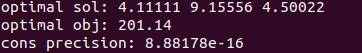

## Homework 3: Constrained Optimization

#### 1. KKT condition

* The code is under code/KKT-condition file. You can see the proof of the question in reprot.

* The files structure is:

  ```markdown
  	KKT-condition 
      | 	CMakeLists.txt
      |
      └───include
      │   │   kkt.hpp
      |
      └───src
      |   |   kkt_example.cpp
      |
      └───build
  ```

* You can run the example by the following code:

  ```shell
  # enter the KKT-condition file
  mkdir build
  cd build
  cmake ..
  make
  ./kkt_example
  ```

* The current example is written below. You can definite the custom Q, c, A, b matrix by modifying the kkt_example.cpp.
  $$
  Q = 
  \begin{bmatrix}
  2 & 1 & 1 \\
  1 & 2 & 1 \\
  1 & 1 & 2
  \end{bmatrix}
  
  \qquad
  
  c =
  \begin{bmatrix}
  1.2 \\
  2.5 \\
  3.8
  \end{bmatrix}
  
  \qquad
  
  A=
  \begin{bmatrix}
  1 & 2 & 3 \\
  2 & 3 & 1
  \end{bmatrix}
  
  \qquad
  b=
  \begin{bmatrix}
  4 \\
  5
  \end{bmatrix}
  $$

* The result is:

  


#### 2. Low Dimension Quadratic Programming

* The code is under code/low-dim-QP file. You can view the detail of the code in report.

* The files structure is:

  ```markdown
      low-dim-QP 
      | 	CMakeLists.txt
      |
      └───include
      │   │   sdqp/sdqp.hpp
      |
      └───src
      |   |   sdqp_example.cpp
      |
      └───build
  ```

* You can run the example by the following code:

  ```shell
  # enter the low-dim-QP file
  mkdir build
  cd build
  cmake ..
  make
  ./sdqp_example
  ```

* The result is:

  


#### 3. Nonlinear Model Predictive Control
