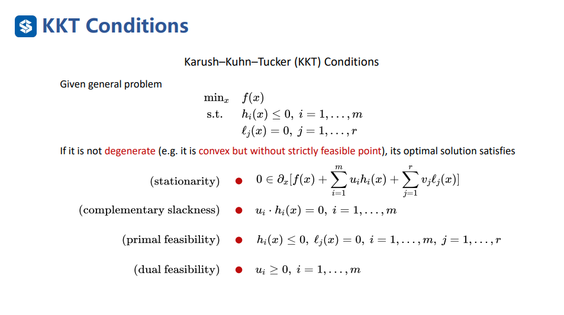
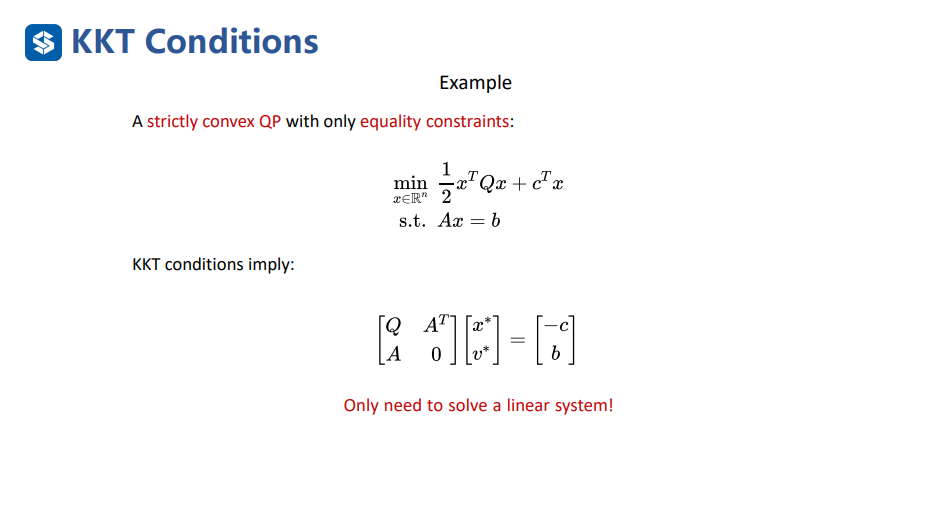
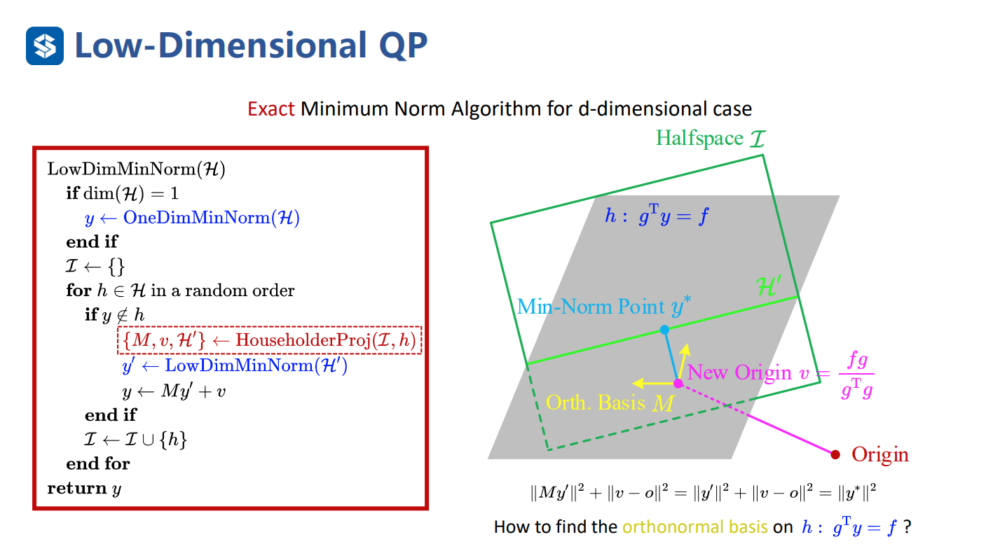
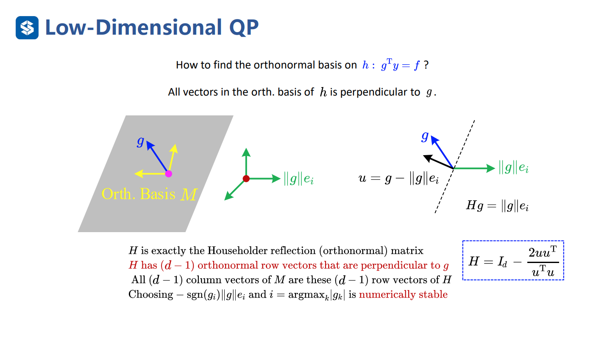
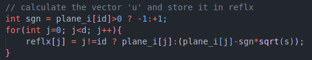
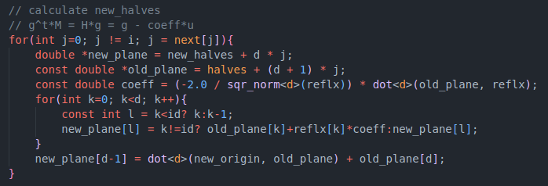

## Homework_3: Constrained Optimization

#### 1. KKT condition

 

* There is only equality constraints. So, the complementary slackness and dual feasibility are already clearly satisfied.

* Implementation of stationarity:
  $$
  \begin{aligned}
  F(x) &= f(x)+\sum_{j=1}^{n}v_jl_j(x) \\
       &= \frac{1}{2} x^T Q x + c^Tx + v^TAx - v^Tb \\
       \\
  \partial_{x}{F(x)} &= Qx + A^Tv + c = 0
  \end{aligned}
  $$

* Implementation of primal feasibility:
  $$
  Ax-b=0
  $$

* The optimal $x^*$ and $v^*$ should satisfy stationarity and primal feasibility:
  $$
  \begin{cases}
  Qx^* + A^Tv^* = -c \\
  Ax^* = b
  \end{cases} 
  $$

  $$
  \begin{bmatrix}
  Q & A^T \\
  A & 0
  \end{bmatrix}
  
  \begin{bmatrix}
  x^* \\
  v^*
  \end{bmatrix}
  
  =
  
  \begin{bmatrix}
  -c \\
  b
  \end{bmatrix}
  $$

* The code is under the code/KKT-condition file. The result is shown in readme.

  

#### 2. Low Dimension Quadratic Programming

* To run the example, we need to finish the Householder Projection part of the low-dim QP algorithm.

  

​	

* Firstly, we need calculate the vector u and store int in reflx. To achieve numerically stability, we can calculate u as follows:
  $$
  u = g + sgn(g_i)||g||e_i,  i = argmax_{k}|g_k|
  $$

* 

​																		

* Secondly, we need calculate the transformed constraints. We can achieve it as follows:
  $$
  \begin{aligned}
  Ay^*-b &\leq 0 \\
  A(My'+v) - b &\leq 0 \\
  AMy' + Av - b &\leq 0
  \end{aligned}
  $$
  To calculate single constrains, we can do this:
  $$
  \begin{aligned}
  a^TM &= a'^T \\
  a^TM &= (Ha)^T \\
  Ha &= a' \\
  Ha &= (I_d - \frac{2uu^T}{u^Tu})a \\
  Ha &= a - (2\frac{u^Ta}{u^Tu})u \\
  a'_i & = a_i - coeff*u_i
  \end{aligned}
  $$
  

* The result is shown in readme.

#### 3. Nonlinear Model Predict Control

* todo
